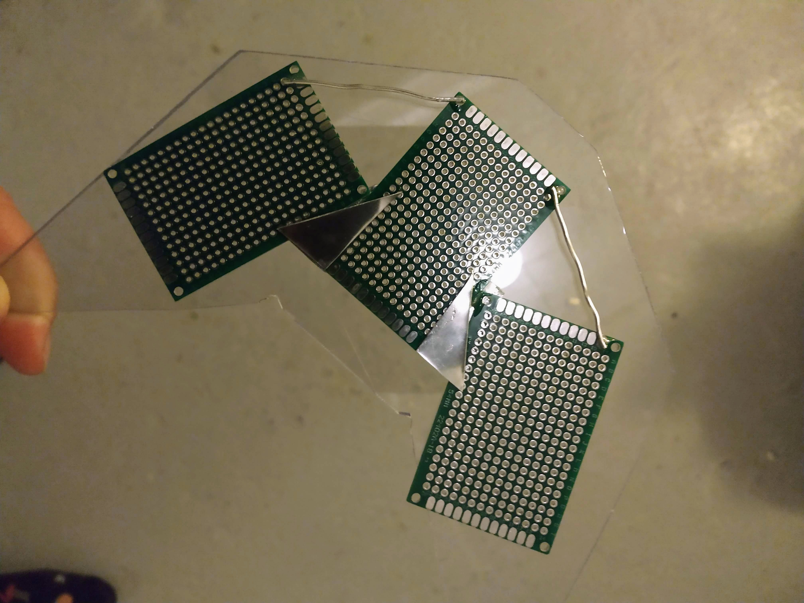
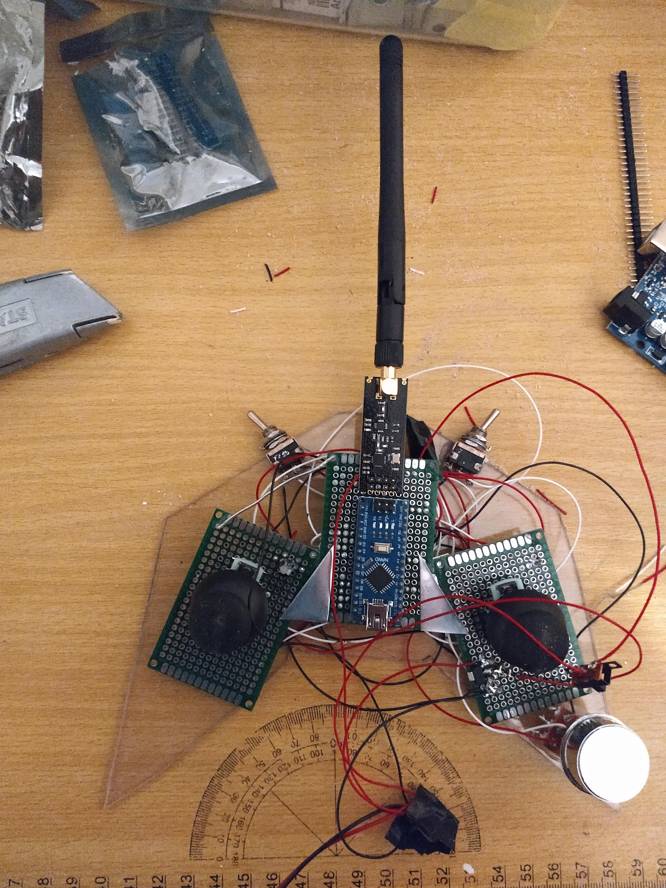
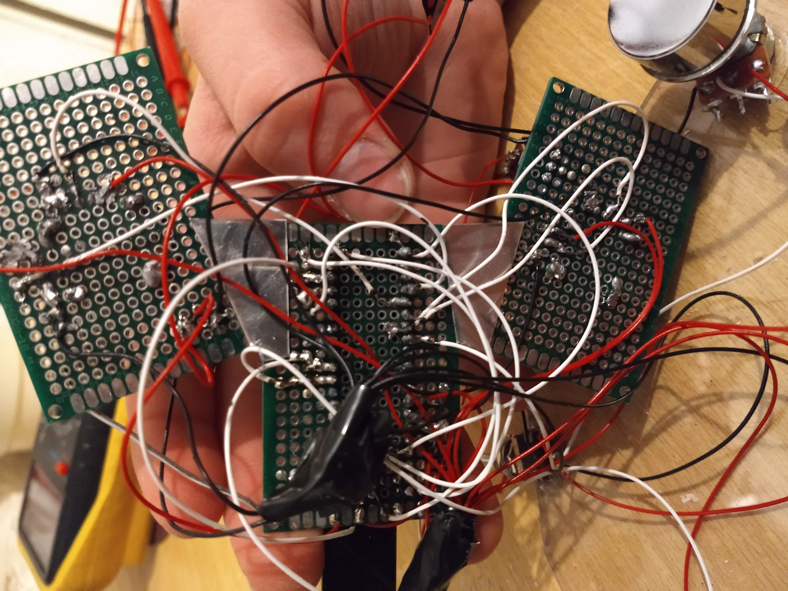
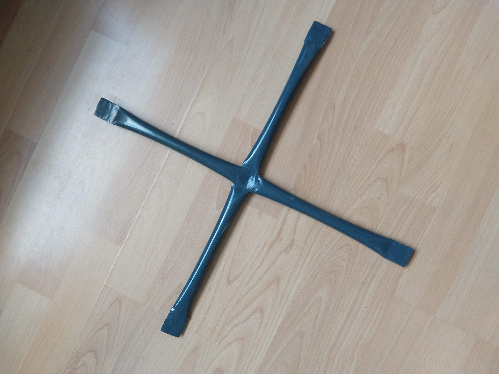
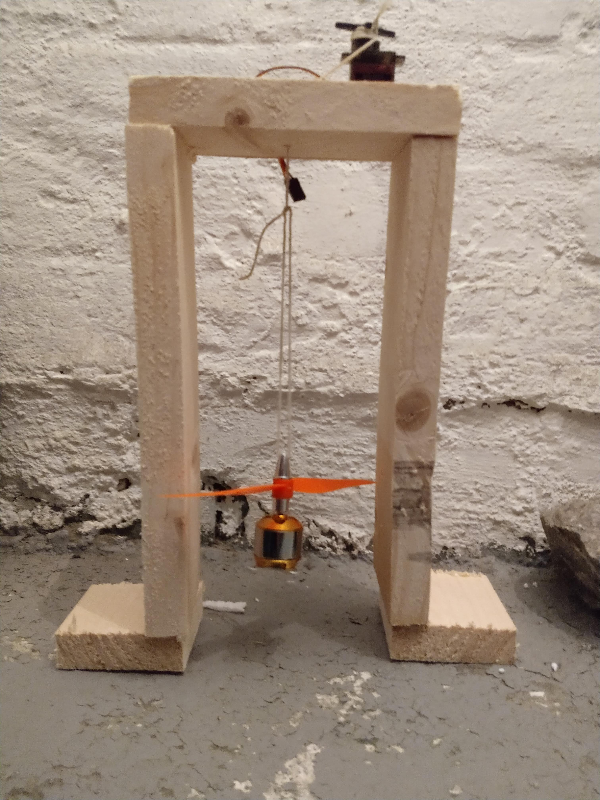
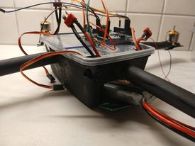
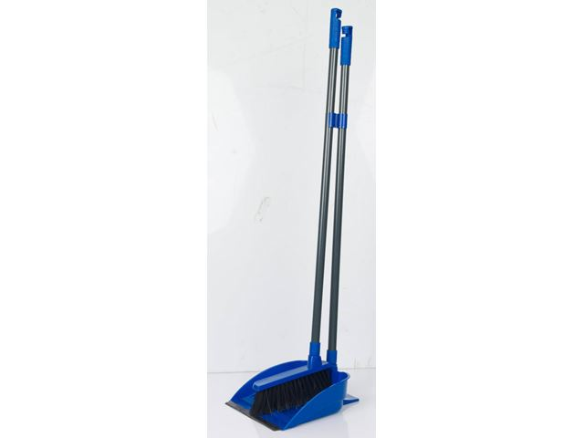

\newpage
# Sammendrag
Denne rapporten handler om et forsøk på å bygge en drone.
Vi reflekterer litt over hvordan man skal bygge en bra drone, hva som kan gå galt
og hvordan vi bygde dronen vår.

# Introduksjon
Målet med prosjektet er å finne ut om det er mulig å bygge en drone for hånd
som er konkurransedyktig mot en tilsvarende fabrikk-produsert drone.
Er det verdt arbeidet og pengene?
Vi forsøkte å bygge dronen billigst mulig med lett tilgjengelige materialer.
Vi valgte å bygge en drone; ikke fordi det er enkelt, men fordi det er vanskelig!

# Teori
Definisjonen på en drone er et flygende fartøy som er ubemannet.
Det kan enten være fjernstyrt eller autonomt. [@snldrone]

Det er to måter å styre en drone: autonom og menneskestyrt.
Vi valgte menneskestyrt fordi vi hadde et begrenset budsjett og autonome droner er både dyrt og vanskelig å lage.
En menneskestyrt drone kan enten styres med en ledning eller med radiosignaler.
Det kan være vanskelig å finne en ledning som er lang nok til å gi ønsket rekkevidde,
så vi valgte av den grunn å bruke radiosignaler.

Thrust er den mekaniske kraften som er generert av motorene til dronen. [@nasathrust]
Thrusten blir laget av at dronen dytter luft i motsatt retning av dit den skal,
og det fører på grunn av Newtons 3. lov til en like stor kraft som skyver dronen i motsatt retning av luften.
Newtons 3. lov sier at en hver kraft mellom to gjenstander har en lik kraft i motsatt retning. [@newtonlov; @nasa-3lov]
Dette vil si at hvis det virker en kraft fra gjenstand A til gjenstand B vil det virke en like stor kraft fra
gjenstand B til gjenstand A, som går i motsatt retning. [@nasa-3lov]

\newpage
Hvis en drone skal fly, må den ha et positivt thrust til vekt forhold.
En tyngre drone krever derfor mer thrust for å fly, og
et høyere thrust til vekt forhold vil gjøre at dronen kan fly fortere.
Man får mer thrust ved å bruke kraftigere motorer, større propeller og større batteri.
Man kan gjøre dronen lettere ved å velge lettere materialer eller mindre av materialene,
men dronen må likevel være sterk nok til å tåle alle kreftene som skal virker på dronen.
[@redbull]

På en drone er det best om tyngdepunktet er lavt,
det vil si det tyngste punktet på dronen.
Den forenklede forklaringen er at det er punktet på dronen som tyngdekraften virker på. [@tyngdepunkt]
Hvis Man tenker seg at man skal hoppe ut av et fly mens man holder en stor stein over hodet,
vil det være mye vanskeligere å lande med beina først enn om man holdt steinen ved beina.
Den tyngste delen vil alltid helst være nederst, da er det enklere å holde balansen.

# Materialer og Metode

{width="60%"}

Den vanligste måten å sette sammen elektronikk på er ved lodding,
som er en metode man bruker for å lage elektrisk kontakt mellom elektriske komponenter, og for å feste dem godt sammen.
For å lodde må man ha en loddebolt og loddetinn, så holder man loddebolten inntil komponentene man skal lodde sammen
(disse komponentene bør være inntil hverandre), så holder man loddetinnet inntil komponentene så det smelter.
For å få gode loddinger er det viktig å passe på at loddetinnet renner gjennom hullene hvis man lodder på kretskort
og at det renner mellom alle trådene inni ledningene når man lodder sammen to ledninger (ledninger surres sammen før de loddes.)

## Dronekontrollen:
For å lage dronekontrollen
tegnet vi et design som passet til kretskortene og
sagde det ut fra pleksiglass og slipte kantene slik de ble glatte.
Kretskortene ble lagt i ønsket konfigurasjon og festet sammen med lim og aluminiumstråd.

{width="60%"}

\newpage
Vi overførte test-koden til mikrokontrollen via en USB kabel og testet kontrollen
med mottaker koblet til en servo.
Etter det ble kretskortene limt fast til pleksiglasset, og kontrolleren ble til.
I tillegg ble alle komponentene loddet fast på kretskortet.

{width="25%"}
{width="45%"}

## Ekso-skjeletet
Ekso-skjeletet til dronen er laget av 2 hule, runde stål-kosteskaft og en boks av plastikk.
Disse er malt med svart varmerresistent spraymaling.
Eksoskjeletett skal tåle opp til 120 grader Celsius før plastikken smelter, og den tåler temperaturer så lave som -40 grader Celsius.

Her ser du plast-boksen, kosteskaftet og arduinoen dronen er laget av.

For å få til et lavt tyngdepunkt, bestemte vi oss for å plassere batteriet lavest mulig.
Dette gjorde vi ved å la krysset være inni øverste delen av en plastboks.
Det ble kuttet hull i sidene til boksen som man kunne stikke røret gjennom.

\newpage
Dronen er selvdesignet. Ved å legge metallrørene på hverandre så de lagde et kryss istedenfor å for å ha 4 separate armer,
reduserer man antall deler og får en mer solid drone.
For å unngå betydelig høydeforskjell på armene ble midten av hvert rør most flat med en tang.

{width="70%"}

Når rørene var i riktig konfigurasjon, ble tek7 brukt rundt hullene for å feste armene til boksen.
Den originale planen var å bruke muttere og bolter til å holde rørene sammen,
men etter at plastboksen ble en del av strukturen, var dronen solid nok til at det holdt med plastboksen og tek7 til å holde dronen sammen.
Ved å bruke en plastboks slik, kan batteriet være inne i boksen som den nederste delen.
Nå har dronen et lavt tyngdepunkt. På grunn av boksen, hadde vi en flate på toppen av lokket som gjorde det enkelt å montere elektronikken på toppen av dronen.
Det ble kuttet en luke i enden av boksen der man enkelt kan ta batteriet inn og ut.
Den ekstra plassen i boksen gir rom for fremtidige oppgraderinger til større batteri.

Det var planlagt å ha bein på dronen. Dette ble ikke nødvendig fordi boksen er stor nok til at dronen bikker opp igjen på boksen dersom den skulle lande skjevt.
Boksen er hard og kan derfor knuse. Siden løsningen med minst masse er å lande med boksen først, ble boksen utstyrt med dempende skum. Skummet er lett og mykt.

## Festing av motorer
Designet hadde en utfordring. Motorene er laget for å monteres på en flat overflate.
Derfor måtte hver ende av armene skvises flat i enden, siden dette er rør.
Disse områdene ble ikke riktig fordi motoren ikke pekte rett opp fra bakken.
Om en av motorene peker litt annen retning enn de andre, vil dronen drifte bortover når man vil fly rett opp.
Det første forsøket på å løse dette problemet var å henge motoren i en snor.
Det går et lite hull i spissen på motoren med ukjent hensikt. Siden motoren er symmetrisk, skulle den i teorien henge i vater,
uansett hva man henger snoren i. Planen var å la det være en klump med to komponent epoxy lim på hver av endene på armene til dronen.
Deretter heise motoren forsiktig ned til den såvidt treffer limen. Da kan man forsterke med mer lim etterpå. Dette ble løst ved å bygge en manuell mini heisekran.
Denne løsningen gikk ikke som planlagt. Tre tykke ledninger stakk ut fra motoren slik at den ikke hang beint. Vi forutså ikke dette.

{width="50%"}

\newpage
For å gjøre dette, bygde vi en miniheisekran. Da ble det satt sammen en enkel firkantet treramme uten bunn og i bunnen ble det skudd fast to små planker til å holde kranen oppe.
Kranen var kun improvisering og ingen mål ble tatt.
Om kranen er skjev, vil fortsatt motoren henge beint.
I midten på toppen av rammen ble det drillet et hull og ved siden av hullet ble det limt fast en servo.
En servo er en elektrisk motor med girkasse.
Knyttet tråden fast i servoen og trådde den gjennom hullet.
Knyttet motoren til andre enden av tråden.
Ved å vri på servoen kan man stille høyden til motoren.
Servoen trenger ikke å styres med strøm.
Hensikten med servoen var at man kan vri på den uten at den spinner tilbake når den møter litt motstand.

Løsningen ble å plassere dronen på en vatret overflate.
Deretter teipe flate plastbiter rund hver av endene på dronens armer.
Da kunne limen flyte i vater mens plastbitene hindret limen i å renne ned fra armene.
Limen ble pusset slik at mer lim ville sitte bedre. Da var det flatt overflate og mulig å lime motorene fast oppå.
Om løsningen var bra nok til at dronen flyr riktig, gjenstår å se.

## Utstyr

### Utstyr miniheisekran:
- Treplanker, alt går
- Servo(I dette tilfellet ble det brukt SG90 servo, men andre tilsvarende kan brukes.)
- Tråd
- Lim
- Skruer

\newpage
### Utstryr kontroll: ###
- Arduino nano
- 10µf kondensator
- 3,3 volt regulator
- Ledninger, (lurt med flere farger for å lage et system. Vi brukte rød til positiv, svart til jord og resten hvit.)
- pleksiglass 3mm eller 6mm
- Limpistol med lim
- tomme kretskort (Et stort eller  flere små)
- NRF24 modul
- blyant
- metallsag
- loddebolt
- loddetinn (med flussmiddel)
- tre brytere ( en for å skru av og på kontrollen og to for å koble til kanaler).
- 2 stk xbox styrespak (disse kommer gjerne loddet fast i et lite kretskort, da må det loddes av)
- pussemaskin
- ståltråd eller aluminiumstråd
- to komponent lim
- Mini b USB kabel
- potensiometer

\newpage

# Resultat
Kontrollen fungerte som den skulle, inkludert alle kanalene, men etter litt testing kortsluttet den og sluttet å fungere.

Når vi designet mottakeren, satte vi alle komponentene for nært hverandre på kretskortet,
og klarte derfor ikke å få gode loddinger uten at ting kortsluttet.
Denne mottakeren gikk opp i flammer og utløste brannalarmen
etter at vi tente den på med en mini-flammekaster
fordi vi mente det ville ta for lang tid å lodde den og mikrokontrolleren av på vanlig vis.
Den neste, derimot fungerte en stund,
men dårlige koblinger gjorde at den kortsluttet og gikk opp i røyk.
Den tredje mottakeren (koblet opp på koblingsbrett) var for å teste om antennene fortsatt fungerte.
Det gjorde de ikke.
Etter mer testing, sa den tredje mottakeren "poff!" og gikk opp i røyk.
Det var brent plastikk under 3,3V regulatoren som er bygd inn i mikrokontrolleren.

Vi testet om mikrokontrolleren (Arduino Nano) fortsatt fungerte.
Det gjorde den ikke.
Dette var den siste Arduino Nanoen vi hadde og den neste koblet vi opp på samme måte, men med en Adafruit Pro Trinket,
som er basert på samme AtMega328 chip-en.
Når det var koblet opp,
målte vi hvor mange volt som kom fra 3,3V regulatoren, og det var 4,9V.
Altså fungerte ikke den. Så den ble byttet ut.

Adafruit Pro Trinket mikrokontrolleren fungerte ikke,
det er ingen tegn på hvorfor den ikke fungerte.

\newpage

# Diskusjon
{width="50%"}

Avgjørelsen for materiale ble tatt etter at Oliver en vakker dag kostet gulvet.
Han oppdaget at metallrøret som var igjen dersom man fjernet håndtak og børste veide svært lite og var sterkt.
Da ble det funnet ut at metallet er magnetisk og må derfor være en type stål.
Selv om plastikk veier mindre, har det et lavere styrke til vekt forhold. Det vil si at man måtte brukt mer plastikk for å oppnå samme styrke.
Veggene i stålrøret er ekstremt tynne og veier derfor mindre enn et tilsvarende plastrør.
Man kunne potensielt brukt et annet design for å bygge en i plast som hadde veid mindre,
men da er man avhengig av å kunne forme plastikken selv. Karbonfiber ville være et bedre alternativ, men kostnaden er for høy.
Til våres formål er det kun to styrespaker og 4 kanaler vi trenger, men resten kan komme til nytte i et fremtidig prosjekt.

Siden ekso-skjelettet til dronen tåler ekstreme temperaturer så godt,
kan det for eksempel brukes på olje-plattformer og i arktiske strøk,
men da må motorene byttes ut med noe som tåler de temperaturene.

Mottakeren har 7 kanaler. Derfor kan to kanaler gå til 2 av/på brytere.
4 kanaler kan gå til to små styrespaker og en kanal til et potensiometer. Dette er kun forskjellige metoder for å sende signaler til dronen.
Potensiometeret er som en lysbryter med dimmer.

Siden den andre mottakeren fungerte, bestemte vi oss for å bestille nye antenner og
prøve på nytt når den tredje mottakeren ikke fungerte.
Alt gikk da delvis etter planen.
"Failure is an option here. If things are not failing you are not innovating." sa @fail.
Altså innoverer du ikke hvis ting ikke går galt.

Målet med designet av kontrolleren var å lage den ulik alle andre. Derfor valgte vi å designe den med skarpe kanter så den skulle minne om en elektrisk gitar.

Etter å ha brent gjennom flere mikrokontrollere i forsøk på å lage en mottaker som ikke ville kortslutte,
hadde vi ikke igjen flere brukbare mikrokontrollere av samme typen.
Vi kunne ha prøvd med en ATMEL ATMEGA 328P brikke, det burde fungere,
men det er også mye tidkrevende arbeid, med feilsøking og utforsking. Derfor ga vi oss her.
Selv om dronen ikke flyr har det vært et gøy og veldig lærerikt prosjekt.
Vi tror at vi kan få dronen til å fly med en del mer tid og arbeid,
men uansett om dronen flyr eller ikke tar vi med oss mye nyttig kunnskap som kommer til å bli nyttig i framtidige prosjekter.

# Konklusjon
Dronen flyr ikke, og er derfor ikke sammenlignbar med en lignende produktkjøpt drone.
Å bygge en drone selv gir likevel nyttig kunnskap og erfaring og
er et veldig gøy prosjekt hvis man ser etter en utfordring.

\newpage
# Referanser
