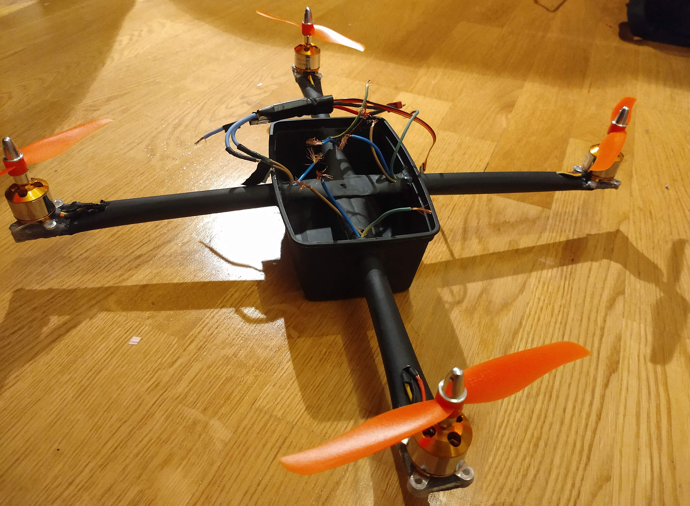
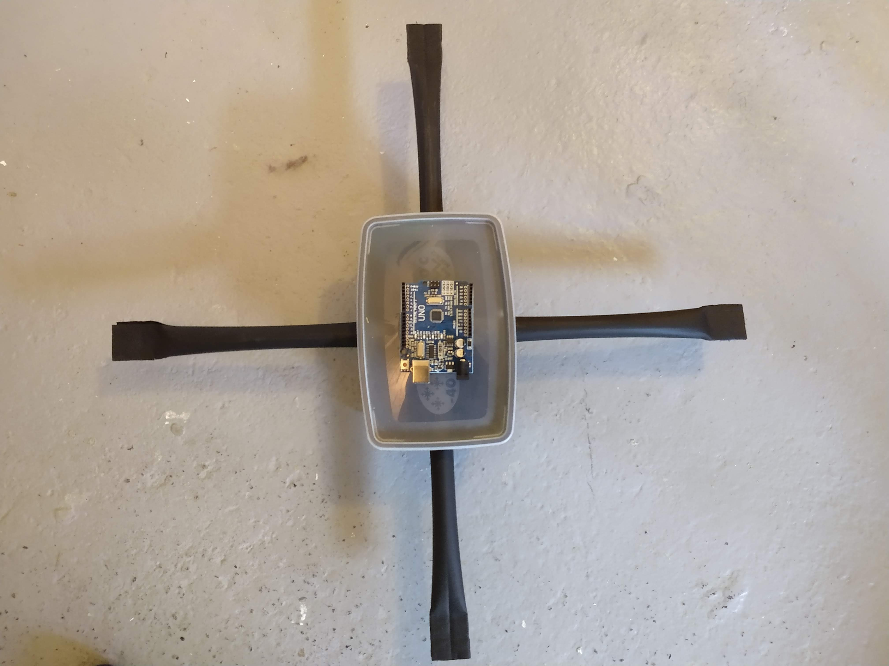
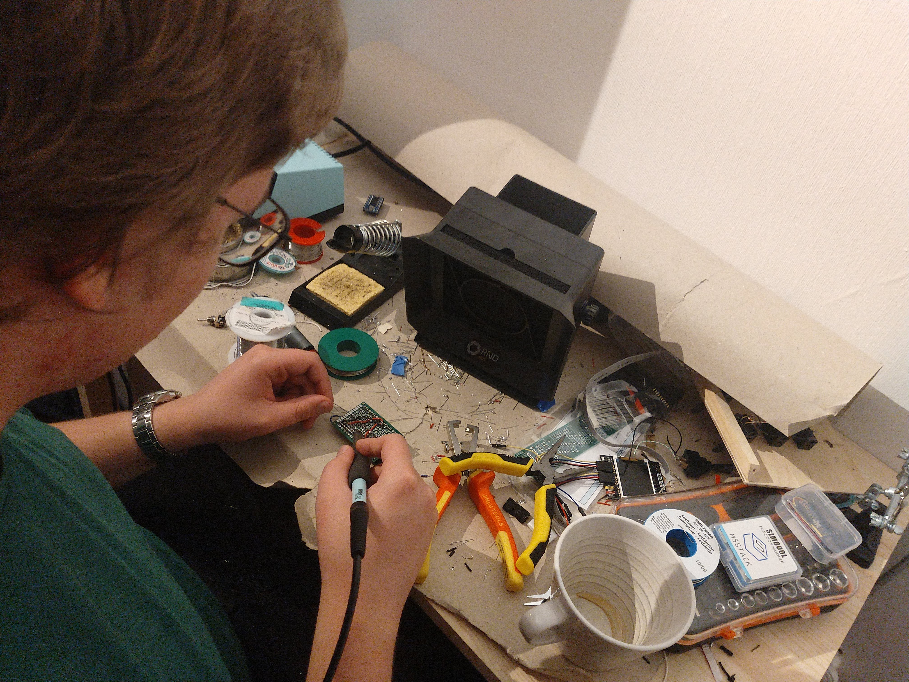

\newpage
# Sammendrag

# Introduksjon
Målet med prosjektet er å finne ut om det er mulig å bygge en drone for hånd
som er konkurransedyktig mot en tilsvarende fabrikk produsert Drone og er det verdt det?
Vi forsøkte å bygge dronen med billigst mulig med lett tilgjengelige materialer.

# Teori
Definisjonen på en drone er et flygende fartøy som er ubemannet.
Det kan enten være fjernstyrt eller autonomt. [@snldrone]

Thrust er den mekanisk kraften som er generert av motorene til dronen. [@nasathrust]
Thrusten blir laget av at dronen dytter luft fra seg,
og det fører på grunn av Newtons 3. lov til en like stor kraft som skyver dronen i motsatt retning.
Newtons 3. lov sier at en hver kraft mellom to gjenstander har en lik kraft i motsatt retning. [@newtonlov]
Dette vil si at hvis det virker en kraft fra gjenstand A til gjenstand B vil det virke en like stor kraft fra
gjenstand B til gjenstand A, som går i motsatt retning. [@nasa-3lov]

Hvis en drone skal fly, må den ha et positivt thrust til vekt forhold.
En tyngre drone krever derfor mer thrust for å fly.
Ett høyere thrust til vekt forhold vil gjøre at dronen kan fly fortere.
Mer thrust får man ved å bruke kraftigere motorer, større propeller og større batteri.
Man kan gjøre dronen lettere ved å velge lettere materialer eller mindre av materialene,
men dronen må likevel være sterk nok til å tåle alle kreftene som skal virker på dronen.
[@redbull]

\newpage
# Materialer og Metode
Eksoskjeletett til dronen er laget av 2 hule, runde stål-kosteskaft og en boks av plastikk.
Disse er malt med svart varmerresistent spraymaling.
Eksoskjeletett skal tåle opp til 120 grader Celsius før plastikken smelter.

Her ser du plast-boksen, kosteskaftet og arduinoen dronen er laget av.

\newpage
Den vanligste måten å sette sammen elektronikk på er ved lodding,
som er en metode man bruker for å lage elektrisk kontakt mellom elektriske komponenter, og for å feste dem godt sammen.
For å lodde må man ha en loddebolt og loddetinn, så holder man loddebolten inntil komponentene man skal lodde sammen
(disse komponentene bør være inntil hverandre), så holder man loddetinnet inntil komponentene så det smelter.
For å få gode loddinger er det viktig å passe på at loddetinnet renner gjennom hullene hvis man lodder på kretskort
og at det renner mellom alle trådene inni ledningene når man lodder sammen to ledninger (ledninger surres sammen før de loddes.)

Sånn ser det ut når man lodder.

Dronen er laget av

# Resultat

# Diskusjon

# Konklusjon

# Referanser
